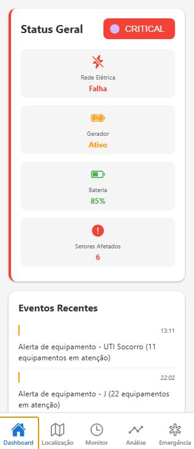
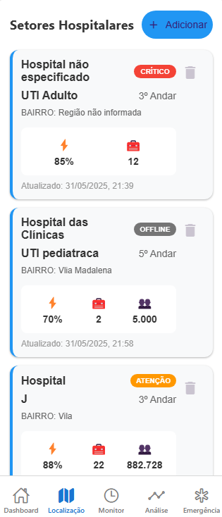
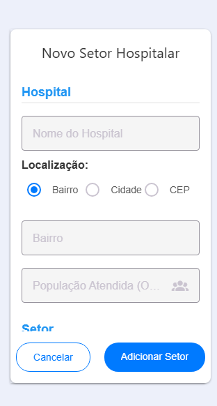
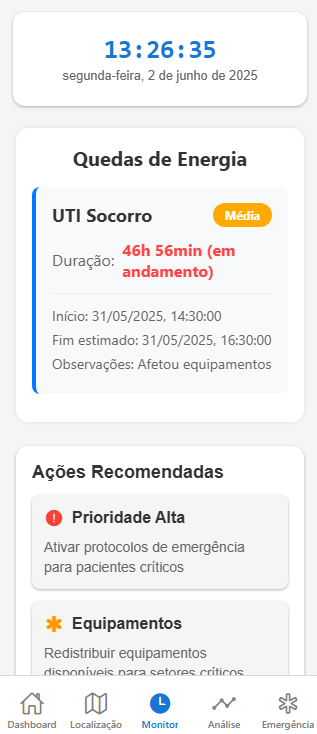
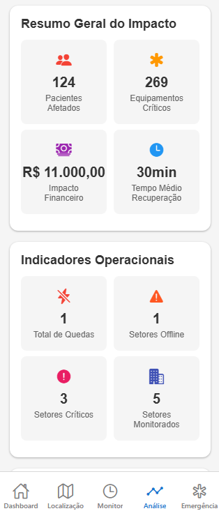
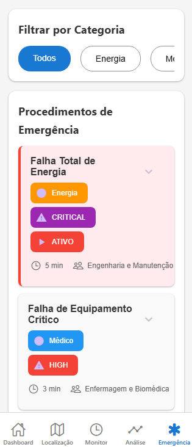

# 📱 Mobile App Development

## 👥 Integrantes do Grupo

| Nome                     | RM     |
| ------------------------ | ------ |
| Kaiky Alvaro Miranda     | 98118  |
| Lucas Rodrigues da Silva | 98344  |
| Juan Pinheiro de França  | 552202 |

# Sistema de Monitoramento de Energia Hospitalar

Um aplicativo mobile desenvolvido em React Native para monitoramento e gerenciamento de episódios de falta de energia em ambientes hospitalares, com foco especial em situações causadas por desastres naturais.

## 📱 Sobre o Projeto

Este aplicativo foi desenvolvido para permitir que hospitais registrem, monitorem e gerenciem localmente informações sobre quedas de energia que possam afetar operações críticas. O sistema utiliza `AsyncStorage` para armazenamento local dos dados, garantindo funcionalidade mesmo durante períodos de instabilidade de rede.

### 🎯 Objetivo Principal

Fornecer uma ferramenta robusta e offline-first para hospitais monitorarem o impacto de faltas de energia em setores críticos, permitindo:

- Registro detalhado de episódios de queda de energia
- Análise de impacto em pacientes e equipamentos críticos
- Procedimentos de emergência organizados
- Monitoramento em tempo real de setores hospitalares

## 🏥 Funcionalidades Principais

### ⚡ Monitoramento de Energia

- Registro de quedas de energia por setor hospitalar
- Acompanhamento de duração e severidade dos episódios
- Estimativa automática de tempo de recuperação
- Histórico completo de ocorrências

### 📊 Análise de Impacto

- Cálculo automático de pacientes afetados
- Estimativa de custos financeiros
- Análise de equipamentos críticos comprometidos
- Relatórios de impacto operacional

### 🚨 Gestão de Emergências

- Biblioteca de procedimentos de emergência
- Contatos de emergência organizados
- Ações recomendadas baseadas na situação atual
- Sistema de priorização por severidade

## 📱 Telas do Aplicativo

### 1. 🏠 **Dashboard**

**Visão geral do sistema hospitalar**

- Status geral do hospital (Normal, Alerta, Crítico)
- Indicadores de rede elétrica e geradores
- Nível de bateria de emergência
- Feed de eventos recentes
- Contadores de setores afetados



### 2. 📍 **Localização/Setores**

**Gerenciamento de setores hospitalares**

- Lista completa de setores cadastrados (UTI, Centro Cirúrgico, Pronto Socorro, etc.)
- Adição e edição de novos setores
- Configuração de equipamentos críticos por setor
- Status individual de cada área
- Histórico de quedas por setor




### 3. ⏰ **Monitor de Tempo**

**Acompanhamento temporal das ocorrências**

- Relógio em tempo real
- Lista de quedas de energia ativas
- Tempo decorrido de cada episódio
- Previsão de restauração
- Histórico recente de ocorrências finalizadas



### 4. 📊 **Análise de Impacto**

**Relatórios e métricas detalhadas**

- Resumo de impacto por setor
- Análise financeira (custos de equipamentos, receita perdida, resposta de emergência)
- Classificação de pacientes por nível de risco
- Métricas de equipamentos críticos afetados
- Tempo estimado de recuperação



### 5. 🚨 **Procedimentos de Emergência**

**Gestão de protocolos e contatos**

- Biblioteca de procedimentos categorizados
- Filtros por tipo de emergência
- Passos detalhados para cada procedimento
- Lista de equipamentos necessários
- Contatos de emergência com disponibilidade
- Procedimentos ativos em andamento



## 🛠 Tecnologias Utilizadas

### Frontend

- **React Native** - Framework principal
- **TypeScript** - Tipagem estática
- **React Navigation** - Navegação entre telas
- **React Native Paper** - Componentes de UI
- **Expo** - Plataforma de desenvolvimento
- **Styled Components** - Estilização

### Armazenamento

- **AsyncStorage** - Persistência local de dados
- **StorageService** - Camada de abstração para gerenciamento de dados

### Paleta de Cores por Severidade

- 🟢 **Normal/Baixo**: Verde (#88AA00)
- 🟡 **Médio**: Amarelo (#FFAA00)
- 🟠 **Alto**: Laranja (#FF8800)
- 🔴 **Crítico**: Vermelho (#FF4444)

### Princípios de Design

- **Interface intuitiva** - Navegação clara e objetiva
- **Código de cores** - Sistema visual para diferentes níveis de severidade
- **Responsividade** - Adaptação para diferentes tamanhos de tela
- **Acessibilidade** - Contraste adequado e elementos bem definidos

## 🗂 Estrutura de Dados

### HospitalSector

```typescript
interface HospitalSector {
  id: string;
  name: string;
  floor: number;
  region: HospitalRegion;
  criticalEquipment: number;
  status: "NORMAL" | "WARNING" | "CRITICAL" | "OFFLINE";
  powerOutages: PowerOutage[];
  currentOutage?: PowerOutage;
  lastUpdate: Date;
}
```

### PowerOutage

```typescript
interface PowerOutage {
  id: string;
  startTime: Date;
  endTime?: Date;
  duration?: number;
  estimatedDuration?: number;
  severity: "LOW" | "MEDIUM" | "HIGH" | "CRITICAL";
  cause?: string;
  affectedSystems?: string[];
  isOngoing: boolean;
  estimatedEndTime?: Date;
  notes?: string;
}
```

## 🚀 Como Executar

### Pré-requisitos

- Node.js (versão 14 ou superior)
- npm ou yarn
- Expo CLI
- Emulador Android/iOS ou dispositivo físico

### Instalação

```bash
# Clone o repositório
git clone

# Navegue até o diretório
cd powerguardian

# Instale as dependências
npm install
# ou
yarn install

# Execute o projeto
expo start
# ou
npx expo start
```
